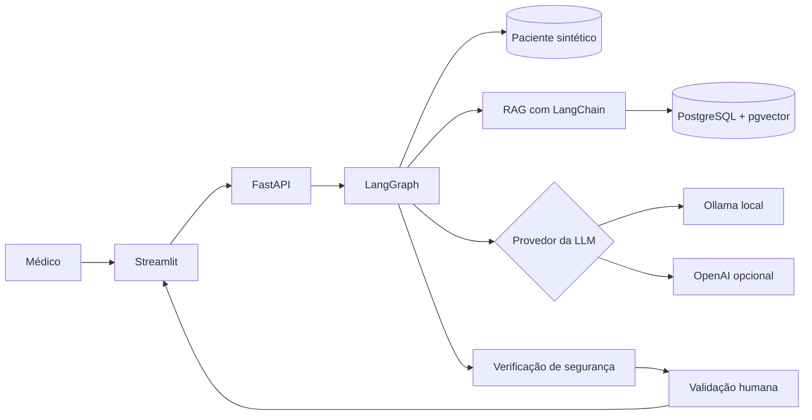

# F3Challenge — CardioAssist AI

Assistente educacional de apoio à decisão clínica em cardiologia, desenvolvido como
Tech Challenge da pós-graduação em Inteligência Artificial para Desenvolvedores.

> [!WARNING]
> Este projeto é um protótipo acadêmico, utiliza somente dados sintéticos e não é um
> dispositivo médico. Suas respostas não substituem avaliação, diagnóstico ou conduta
> de um profissional de saúde. Toda resposta deverá passar por validação humana.

## Objetivo

O CardioAssist AI receberá dados clínicos sintéticos e uma pergunta sobre um paciente,
consultará seu histórico, exames e protocolos médicos e produzirá uma resposta
contextualizada, com fontes e alertas de segurança.

O projeto será construído progressivamente, começando por um RAG simples e funcional.
Novos componentes serão adicionados somente quando a versão anterior estiver testada.

## Casos de uso planejados

- analisar um quadro de hipertensão considerando histórico e exames;
- destacar fatores de risco e sinais de alerta em relatos de dor torácica;
- contextualizar resultados de exames com o histórico sintético do paciente;
- identificar exames pendentes e gerar alertas;
- registrar a resposta e permitir validação humana.

## Escopo da primeira versão

A primeira versão terá:

- documentos médicos selecionados para a base de conhecimento;
- pacientes e exames inteiramente sintéticos;
- recuperação de contexto com RAG;
- geração local com Ollama ou, opcionalmente, OpenAI;
- fluxo simples de recuperação, geração e verificação com LangGraph;
- resposta acompanhada das fontes recuperadas;
- API com FastAPI;
- interface com Streamlit;
- testes básicos.

O fine-tuning com LoRA ou QLoRA será desenvolvido em uma etapa posterior e comparado
com prompt engineering, few-shot e RAG. Por causa do hardware local, o treinamento
será executado no Google Colab, Kaggle ou em uma GPU temporária. A inferência continuará
podendo ser feita localmente com Ollama.

## Arquitetura inicial



O fluxo será refinado à medida que os módulos forem implementados. No início, ele será
mantido pequeno para facilitar o aprendizado, os testes e a depuração.

## Tecnologias

- Python 3.12.10;
- FastAPI e Uvicorn;
- Streamlit;
- LangChain e LangGraph;
- Ollama e integração opcional com OpenAI;
- PostgreSQL com extensão pgvector;
- LangSmith opcional para rastreamento e avaliação;
- pytest e Ruff;
- Docker em uma etapa posterior;
- Hugging Face, PEFT e LoRA/QLoRA na etapa de fine-tuning.

## Requisitos do ambiente

- Windows 11;
- Visual Studio Code;
- Python 3.12.10;
- Git;
- Ollama;
- PostgreSQL com pgvector, que será configurado posteriormente com Docker;
- conta OpenAI somente se o provedor opcional for utilizado;
- conta LangSmith somente se o rastreamento remoto for habilitado.

Hardware local informado:

- processador Intel Core i5-1135G7;
- 7,74 GB de RAM;
- Intel Iris Xe Graphics com aproximadamente 2 GB de memória compartilhada.

Esse computador é adequado para o desenvolvimento e para modelos pequenos e
quantizados no Ollama, mas não é indicado para treinar um modelo com QLoRA.

## Configuração inicial no Windows

Abra o PowerShell no terminal do Visual Studio Code e entre no projeto:

```powershell
Set-Location C:\Python\F3Challenge-CardioAssistAI
```

Crie o ambiente virtual:

```powershell
py -3.12 -m venv .venv
```

Ative o ambiente:

```powershell
.\.venv\Scripts\Activate.ps1
```

Confirme o Python selecionado:

```powershell
python --version
python -c "import sys; print(sys.executable)"
```

O executável deve apontar para:

```text
C:\Python\F3Challenge-CardioAssistAI\.venv\Scripts\python.exe
```

Instale as dependências:

```powershell
python -m pip install --upgrade pip
python -m pip install --requirement requirements.txt
```

Copie as variáveis de exemplo:

```powershell
Copy-Item .env.example .env
```

O arquivo `.env` é local e está protegido pelo `.gitignore`. Nunca registre chaves de
API ou senhas reais no Git.

Para desativar o ambiente virtual:

```powershell
deactivate
```

## Validação da instalação

Com o ambiente virtual ativo, execute:

```powershell
python -m pip check
python -m pytest --version
python -m ruff --version
```

O primeiro comando deverá informar:

```text
No broken requirements found.
```

Ainda não há uma API ou interface para iniciar. Os respectivos comandos serão
adicionados quando esses componentes forem criados.

## Estrutura atual

```text
F3Challenge-CardioAssistAI/
├── .env.example
├── .gitignore
├── README.md
└── requirements.txt
```

A estrutura será expandida arquivo por arquivo, sem criar antecipadamente módulos que
ainda não serão utilizados.

## Segurança e privacidade

- usar exclusivamente pacientes, históricos e exames sintéticos;
- não inserir nomes, documentos ou informações reais de pacientes;
- não armazenar chaves de API no repositório;
- apresentar fontes utilizadas pelo RAG;
- indicar quando não houver contexto suficiente;
- tratar a saída da LLM como sugestão, nunca como diagnóstico definitivo;
- exigir validação humana antes de aceitar uma resposta clínica.

## Status

Projeto em construção. Configuração inicial do repositório e das dependências em
andamento.

## Autores

- Giancarlo Rantes
- Jair Ribeiro
- Matheus Cordeiro
- Rafael Macoto