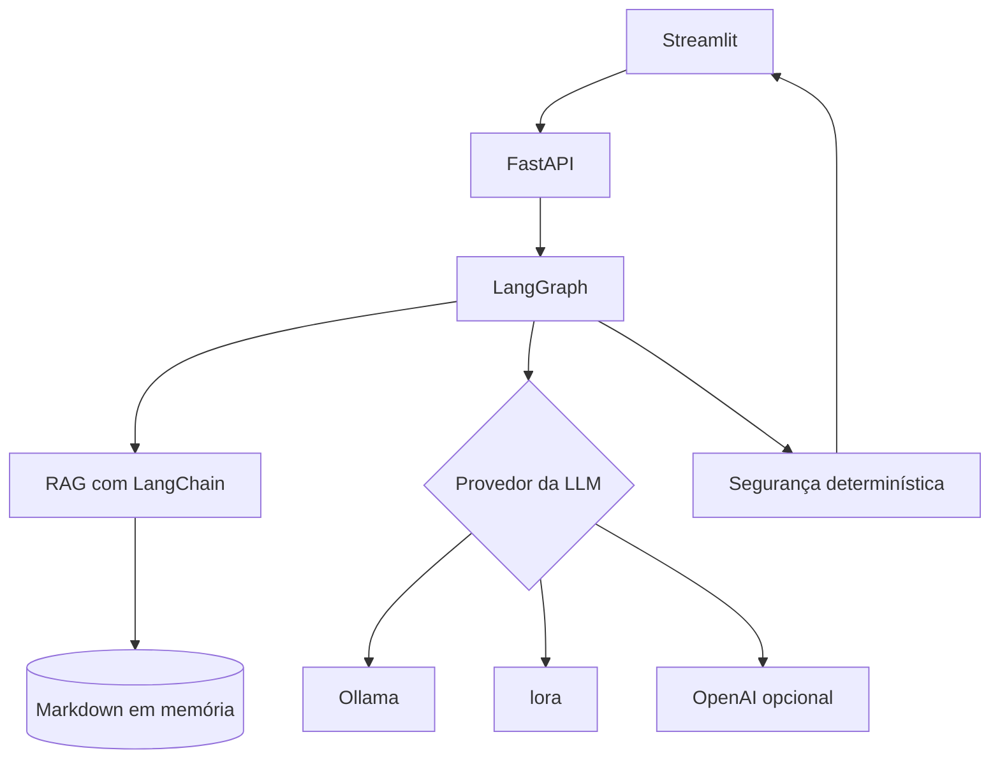

# F3Challenge — CardioAssist AI

Assistente educacional de apoio à decisão clínica em cardiologia, desenvolvido como
Tech Challenge da pós-graduação em Inteligência Artificial para Desenvolvedores.

> [!WARNING]
> Este projeto é um protótipo acadêmico, utiliza somente dados sintéticos e não é um
> dispositivo médico. As respostas não substituem avaliação, diagnóstico ou conduta
> profissional. Toda saída deve passar por validação humana.

## Objetivo

O CardioAssist AI recebe uma pergunta sobre um paciente sintético, recupera trechos
relevantes de uma base de conhecimento, gera uma resposta contextualizada e aplica
regras determinísticas de segurança antes de devolver a resposta, as fontes e os
alertas identificados.

O desenvolvimento é incremental: cada componente é implementado e testado antes da
inclusão da próxima camada.

## Funcionalidades implementadas

- API REST com FastAPI e documentação Swagger;
- interface web com Streamlit;
- contratos de entrada e saída com Pydantic;
- carregamento de documentos Markdown com metadados;
- divisão de documentos em trechos com `RecursiveCharacterTextSplitter`;
- embeddings locais fixos com Ollama;
- seleção da LLM de geração entre Ollama e OpenAI na interface;
- busca semântica em memória com `InMemoryVectorStore`;
- geração contextualizada com LCEL e `StrOutputParser`;
- fluxo de recuperação, geração e segurança com `StateGraph`;
- identificação determinística de pressão muito elevada e sinais de alerta;
- fontes incluídas na resposta;
- revisão humana obrigatória;
- testes unitários e testes opcionais de integração com Ollama.

## Casos de uso

- analisar um quadro sintético de hipertensão;
- destacar sinais de alerta associados à dor torácica;
- contextualizar informações usando documentos recuperados;
- devolver fontes e alertas para revisão profissional.

Análise estruturada de exames, histórico persistente do paciente e exames pendentes
permanecem planejados para etapas posteriores.

## Arquitetura atual



O fluxo compilado do LangGraph possui seis nós:

```text
[prontuario, exames_pendentes] → classify → [retrieve, generate] → safety
```

1. `prontuario` carrega o resumo do paciente se encontrado;
2. `exames_pendentes` lista os examens pendentes que ainda não tem resultado;
3. `classify` classifica a pergunta para saber a intenção e determinar a instrução e/ou uso do RAG;
4. `retrieve` recupera os documentos semanticamente relacionados à pergunta;
5. `generate` monta o contexto e consulta a LLM usando uma cadeia LCEL;
6. `safety` identifica sinais críticos e acrescenta alertas determinísticos.

O armazenamento vetorial atual é em memória. PostgreSQL com pgvector será introduzido
quando adicionarmos pacientes, exames e persistência da base vetorial.

## Tecnologias

- Python 3.12.10;
- FastAPI e Uvicorn;
- Streamlit;
- Pydantic;
- LangChain e LCEL;
- LangGraph e `StateGraph`;
- Ollama e integração opcional com OpenAI;
- HTTPX;
- pytest;
- Ruff.
- unsloth
- peft

Tecnologias planejadas para etapas posteriores:

- PostgreSQL e pgvector;
- checkpoints e persistência do LangGraph;
- LangSmith para rastreamento e avaliação;
- Docker;
- Hugging Face, PEFT e LoRA/QLoRA.

## Data set Utilizado no Treinamento 
https://huggingface.co/datasets/recogna-nlp/drbode_dataset?utm_source=chatgpt.com

## Ambiente de desenvolvimento

Ambiente utilizado no desenvolvimento:

- Windows 11;
- Visual Studio Code;
- Python 3.12.10;
- Intel Core i5-1135G7;
- 7,74 GB de RAM;
- Intel Iris Xe com aproximadamente 2 GB de memória compartilhada.

Esse hardware é suficiente para desenvolvimento e inferência com modelos pequenos e
quantizados. Ele não é adequado para treinamento local com QLoRA. Caso o fine-tuning
seja justificado pelas avaliações, o treinamento será feito no Colab, Kaggle ou em
uma GPU temporária.

## Programas necessários

- Git;
- Python 3.12.10;
- Visual Studio Code;
- Ollama;
- extensão Python da Microsoft para VS Code;
- extensão Pylance da Microsoft;
- extensão Ruff da Astral Software.

OpenAI e LangSmith são opcionais e exigem contas e chaves próprias somente quando
seus respectivos recursos forem habilitados.

## Configuração no Windows

Abra o PowerShell no terminal do VS Code:

```powershell
Set-Location C:\Python\F3Challenge-CardioAssistAI
```

Crie o ambiente virtual:

```powershell
py -3.12 -m venv .venv
```

Ative o ambiente:

```powershell
.\.venv\Scripts\Activate.ps1
```

Confirme o interpretador:

```powershell
python --version
python -c "import sys; print(sys.executable)"
```

O executável deverá apontar para:

```text
C:\Python\F3Challenge-CardioAssistAI\.venv\Scripts\python.exe
```

Atualize o pip e instale as dependências:

```powershell
python -m pip install --upgrade pip
python -m pip install --requirement requirements.txt
python -m pip check
```

Crie a configuração local:

```powershell
Copy-Item .env.example .env
```

O arquivo `.env` está protegido pelo `.gitignore`. Nunca registre chaves, senhas ou
tokens reais no Git.

Para desativar o ambiente virtual:

```powershell
deactivate
```

## Configuração do Ollama

Confirme a instalação:

```powershell
ollama --version
ollama list
```

Baixe o modelo de embeddings:

```powershell
ollama pull nomic-embed-text
```

Para reproduzir o ambiente local utilizado nos testes, use o Phi-3:

```powershell
ollama pull phi3:latest
```

Configure no `.env`:

```env
LLM_PROVIDER="ollama"
OLLAMA_BASE_URL="http://localhost:11434"
OLLAMA_CHAT_MODEL="phi3:latest"
OLLAMA_EMBEDDING_MODEL="nomic-embed-text"
```

`LLM_PROVIDER` define somente a opção inicial da interface. Os embeddings permanecem
no Ollama independentemente da LLM escolhida para gerar a resposta.

Para habilitar a opção OpenAI, configure também:

```env
OPENAI_API_KEY="substitua-pela-chave-real-no-arquivo-env"
OPENAI_CHAT_MODEL="gpt-5-mini"
```

Teste o modelo:

```powershell
ollama run phi3:latest "Responda somente: funcionando"
```

## Executando a aplicação

FastAPI e Streamlit devem ser executados em terminais separados.

### Terminal 1 — API

```powershell
Set-Location C:\Python\F3Challenge-CardioAssistAI
.\.venv\Scripts\Activate.ps1
python -m uvicorn app.main:app --reload --host 127.0.0.1 --port 8000
```

Endereços disponíveis:

- API: <http://127.0.0.1:8000/>;
- saúde: <http://127.0.0.1:8000/health>;
- Swagger: <http://127.0.0.1:8000/docs>;
- OpenAPI: <http://127.0.0.1:8000/openapi.json>.

### Terminal 2 — interface

```powershell
Set-Location C:\Python\F3Challenge-CardioAssistAI
.\.venv\Scripts\Activate.ps1
python -m streamlit run app\ui.py
```

A interface ficará disponível em:

<http://localhost:8501>

Use exclusivamente casos sintéticos, por exemplo:

```text
Paciente sintético com pressão 190/125 e dor torácica. Quais são os sinais de alerta?
```

A primeira execução pode demorar enquanto o Ollama carrega os modelos na memória.
A interface aguarda até 300 segundos pela resposta da API.

Na barra lateral, selecione `Ollama — local e gratuito` ou `OpenAI — API paga`. Essa
seleção altera somente a LLM de geração; a recuperação continua usando
`nomic-embed-text` no Ollama.

## Endpoints

### `GET /`

Apresenta a API e o endereço da documentação.

### `GET /health`

Exemplo de resposta:

```json
{
  "status": "saudável",
  "ambiente": "development",
  "provedor_llm": "ollama"
}
```

### `POST /assist`

Corpo da requisição:

```json
{
  "question": "Paciente sintético com pressão 190/125 e dor torácica. Quais são os sinais de alerta?",
  "llm_provider": "ollama"
}
```

Estrutura resumida da resposta:

```json
{
  "answer": "ALERTA DE SEGURANÇA: ...",
  "sources": [
    "data/knowledge_base/hipertensao.md"
  ],
  "safety_alerts": [
    "pressão arterial muito elevada",
    "dor torácica"
  ],
  "safety_status": "emergencia",
  "requires_human_review": true
}
```

No Windows PowerShell 5.1, envie textos acentuados como UTF-8:

```powershell
$body = @{
    question = "Paciente sintético com pressão 190/125 e dor torácica. Quais são os sinais de alerta?"
} | ConvertTo-Json

$bodyUtf8 = [System.Text.Encoding]::UTF8.GetBytes($body)

Invoke-RestMethod `
    -Uri "http://127.0.0.1:8000/assist" `
    -Method Post `
    -ContentType "application/json; charset=utf-8" `
    -Body $bodyUtf8 `
    -TimeoutSec 300
```

## Testes e qualidade

Formate e valide o código:

```powershell
python -m ruff format app tests
python -m ruff check app tests
python -m ruff format --check app tests
```

Execute os testes que não dependem do Ollama:

```powershell
python -m pytest -v
```

Os testes de integração com o Ollama ficam desabilitados por padrão. Para executá-los
na sessão atual do PowerShell:

```powershell
$env:RUN_OLLAMA_TESTS = "true"
python -m pytest tests\test_rag.py tests\test_generation.py -v
```

Para remover a variável sem gerar erro caso ela não exista:

```powershell
Remove-Item Env:RUN_OLLAMA_TESTS -ErrorAction SilentlyContinue
```

Os testes estão separados por responsabilidade:

- `test_main.py`: endpoints e contratos da API;
- `test_rag.py`: carregamento, divisão, embeddings e recuperação;
- `test_generation.py`: prompt, cadeia LCEL e geração;
- `test_graph.py`: fluxo LangGraph e segurança;
- `test_ui.py`: comunicação HTTP usada pelo Streamlit.

## Estrutura atual

```text
F3Challenge-CardioAssistAI/
├── .env.example
├── .gitattributes
├── .gitignore
├── README.md
├── requirements.txt
├── app/
│   ├── __init__.py
│   ├── config.py
│   ├── generation.py
│   ├── graph.py
│   ├── main.py
│   ├── rag.py
│   ├── schemas.py
│   └── ui.py
├── data/
│   └── finetuning/
|       ├── dataset_cardiologia_amostra.json
│   └── knowledge_base/
│       ├── dor_toracica.md
│       └── Hipertensão Arterial Sistêmica.pdf
│       └── hipertensao.md
│   └── loramodel/
│       ├── adapter_config.json
│       └── adapter_model.safetensors
│       └── chat_template.jinja
│       └── tokenizer_config.json
│       └── tokenizer.json
│   └── synthetic/
|       ├── prontuarios.json
├── finetuning/
│   └── finetuning_cardioassist.ipynb
├── logs/
│   └── cardioassist.log
└── tests/
    ├── test_generation.py
    ├── test_graph.py
    ├── test_main.py
    ├── test_rag.py
    └── test_ui.py
```

## Segurança e privacidade

- utilizar exclusivamente pacientes, históricos e exames sintéticos;
- não informar nomes, documentos ou dados reais de pacientes;
- não registrar perguntas clínicas nos logs técnicos da interface;
- nunca armazenar chaves ou senhas no repositório;
- exigir validação humana para todas as respostas;
- destacar sinais críticos por regras independentes da LLM;
- apresentar os arquivos recuperados como fontes;
- tratar a saída do modelo como apoio educacional, nunca como diagnóstico.

## Limitações atuais

- a base possui resumos educacionais sobre hipertensão e dor torácica;
- o armazenamento vetorial é recriado em memória;
- ainda não há persistência de pacientes, exames ou conversas;
- as fontes exibidas indicam os documentos recuperados, não garantem que cada frase
  gerada esteja integralmente fundamentada;
- modelos pequenos, como Phi-3, podem produzir erros de escrita, interpretações
  imprecisas ou atribuições não presentes no documento;
- a camada determinística reconhece somente os padrões implementados;
- o sistema não foi validado para uso clínico real.

## Fine-tuning

O fine-tuning ainda não foi implementado. Antes dessa etapa, o projeto comparará a
versão atual com melhorias de prompt, few-shot e RAG. LoRA ou QLoRA somente será usado
se as avaliações mostrarem um problema de comportamento ou formato que não seja
resolvido adequadamente pelo contexto recuperado.

Conhecimento médico atualizado deve permanecer no RAG. O fine-tuning não deve ser
utilizado como substituto de uma base documental rastreável.

## Próximas etapas

1. ampliar a base sintética e documental;
2. adicionar avaliação de recuperação e fidelidade das respostas;
3. implementar persistência com PostgreSQL e pgvector;
4. adicionar histórico sintético e exames;
5. configurar checkpoints do LangGraph;
6. habilitar rastreamento e avaliação com LangSmith;
7. comparar prompt, few-shot, RAG e LoRA/QLoRA;
8. configurar Docker e instruções de deploy.

## Status

A primeira vertical funcional está concluída: interface, API, RAG, geração, fluxo
LangGraph, segurança, fontes e testes automatizados. O projeto continua em evolução
incremental.

## Autores

- Giancarlo Rantes
- Jair Ribeiro
- Matheus Cordeiro
- Rafael Macoto
